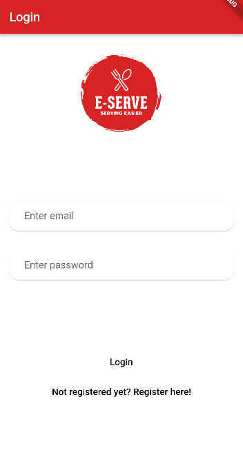
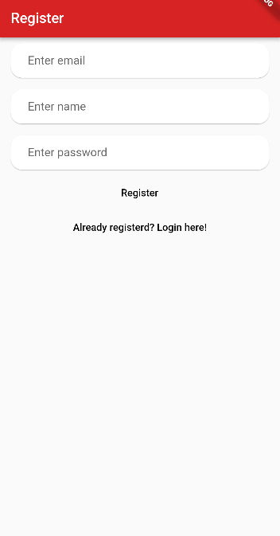
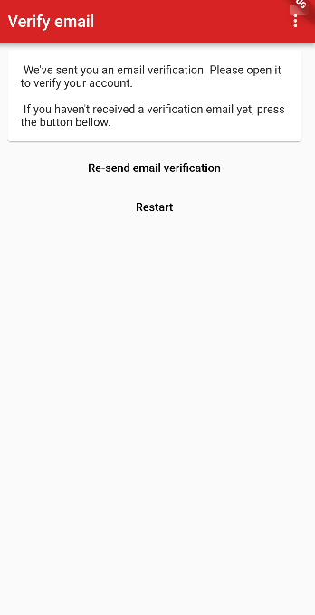
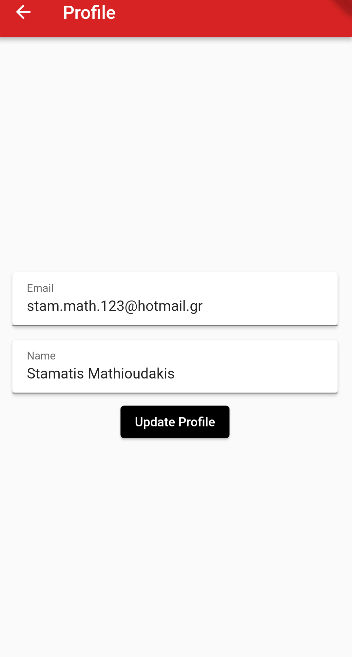
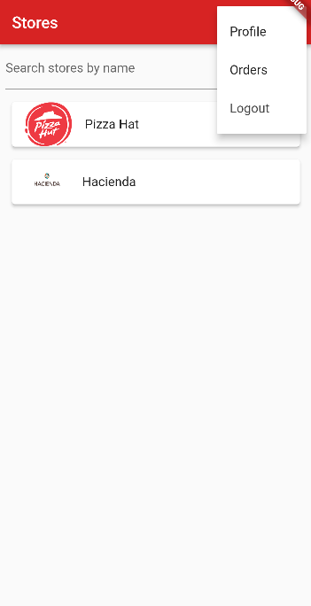

# e_serve

This is a thesis project made for our university.

<h2>⚡️ Quick Start</h2>

This project was made to address the technological need in foodservice and business. It is divided into two applications one for shopkeepers (desktop app) and one for customers (mobile app).

This is the source code of the mobile app project.

- The aim of the project is to familiarize students with technologies that build desktop and mobile applications as well as their theoretical and practical understanding.

- The development of applications was done using: Flutter & Dart (mobile app), Java & JavaFX (desktop app) and Firebase & Firestore (shared database).

<h2>🚀 Pages </h2>

- Login/Register

 

- Order Procedure

 

 

- Profile pages

  

- Home Page

